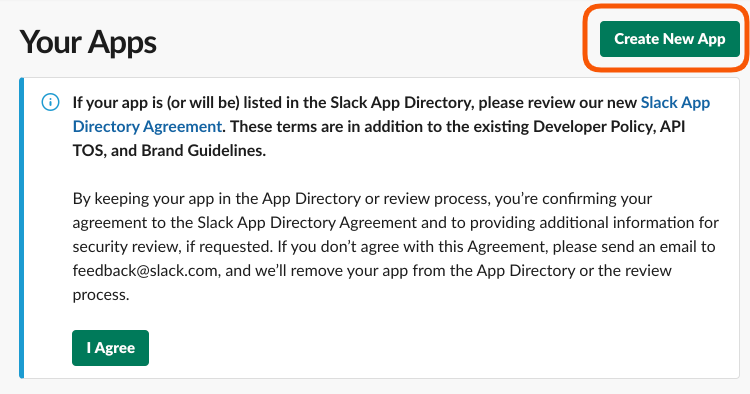
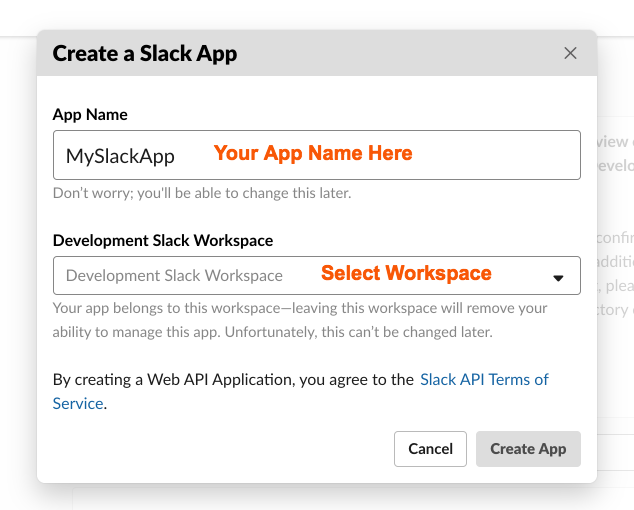
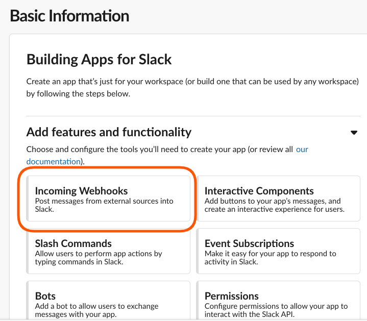
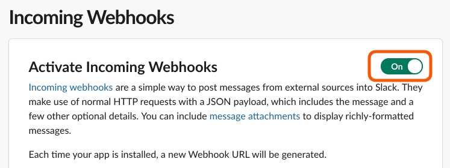
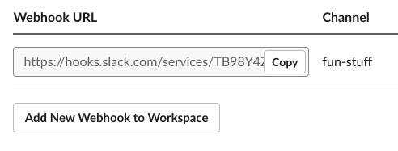
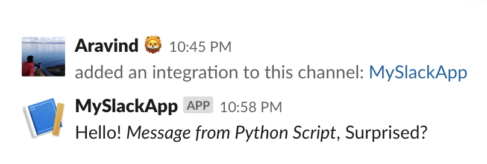

# slack-messaging
Sent Message/Notifications to Slack Channels using Python Script

To make use of this script we first need to create a Slack App for us to post on behalf of the script.

## Create a Slack App

You can follow the steps [here](https://api.slack.com/apps) or follow the steps below. (The screens and content in the following steps are captured during the development of the project, this might be changed now)

- Create a Slack App

As we are going to post Messages into Slack, We need to configure our Slack App to look for `Incoming Webhooks`
Select Webhooks from the basic information page as follows.

Turn on `Activate Incoming Webhooks` from the next page.

On this screen, Select `Add New Webhook to Workplace`. It will take you to a screen where u can select the slack channels available.

Now that you selected the channel to post, Slack will create a `Webhook URL` for us to POST the messages.

Copy the Webhook URL and past in our `slackMessaging.py` file in place of `WEBHOOK_URL`.

Run the file `python slackMessaging.py` and tada!! a message will be posted to the channel. which says `Hello! Message from Python Script, Surprised?`.

Hope your truly surprised with how simple it is to message from 3rd party application to slack Slack.

To format the messages, follow the links [Message Formatting](https://api.slack.com/docs/messages/builder)
